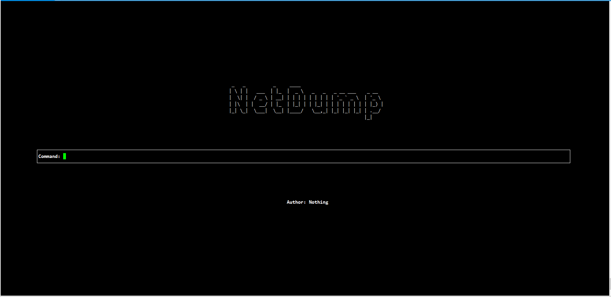
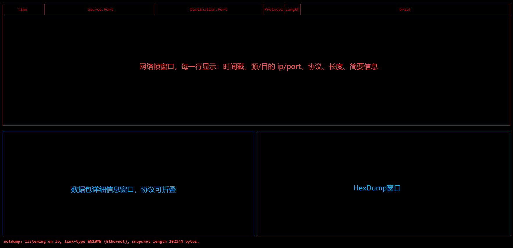
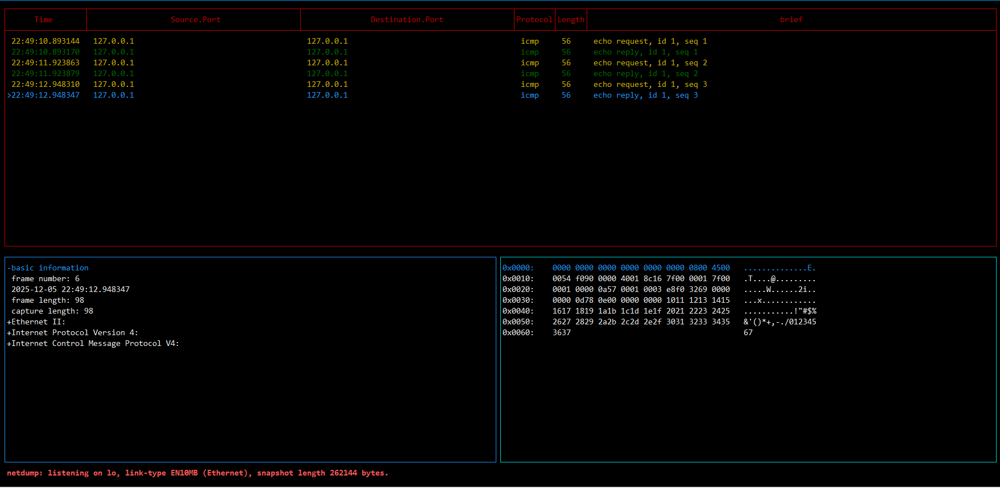
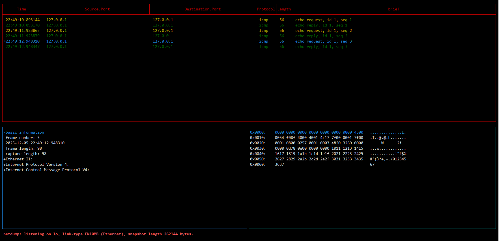
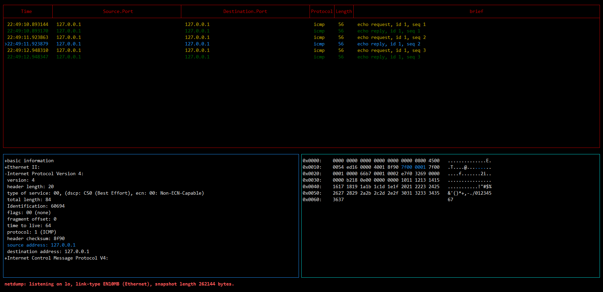
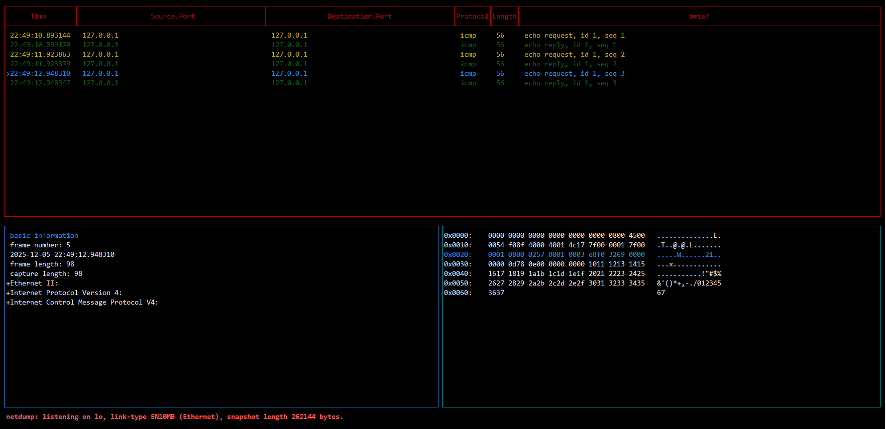

## 项目名称
**network packet capture and dump (netdump)**

## 项目简介
目前是基于 libpcap 的网络抓包工具，相较于 tcpdump 提供了 TUI 界面，有更好的人机交互。

最终的目标是集成 **libpcap**、**xdp**、**dpdk** 的高性能抓包软件

## 技术架构
目前采用了多进程的架构来实现，分别是抓包进程、帧解析进程、TUI 展示进程。

## 项目特性

### TUI 特性
1. 终端实时刷新
2. TUI 界面一用于命令的输入
3. TUI 界面二用于展示网络帧，使用三个窗口来显示不同的信息，分别是**网络帧窗口**，**数据包详细信息窗口**，**HexDump窗口**
4. **网络帧窗口** 每一行显示：时间戳、源/目的 ip/port、协议、长度、简要信息
5. **HexDump窗口** 与 **数据包详细信息窗口** 协议字段对应映射（字段选中高亮 + HexDump 高亮对应位置）
6. **状态栏** 显示过滤条件、网卡名
7. 键盘交互（切换窗口、选网络帧、选字段、协议折叠、暂停、继续、退出）

### 技术特性
1. 基于 libpcap 的单次数据拷贝
2. 基于共享内存的、原子操作的多进程间传递数据
3. 自定义协议解析框架（模块化）
4. 预分配、无 malloc 路径

## 编译与依赖
### 安装编译工具
* **ubuntu** 

    `apt update`

    `apt install -y build-essential autoconf automake libtool pkg-config flex bison`
* **centos**

    `yum update -y`

    `yum install -y autoconf automake libtool pkgconfig flex bison`

    `yum groupinstall -y "Development Tools"`

### 编译
在 **netdump** 目录中直接执行 **make** 命令即可获得可执行程序 **"netdump"**

## 快速开始
### 注意事项

* Linux shell 终端执行 **netdump** 需要 **root** 权限
* Linux shell 终端执行 **netdump** 对屏幕尺寸有一定要求，当提示屏幕尺寸不够时请修改终端的字体大小
* Linux shell 终端执行 **netdump** 时，由于对资源的初始化，存在十秒左右的等待

### TUI 界面介绍与使用方法
#### TUI 指令输入界面

界面中 Command 命令框用于输入指令，以下是一些目前支持的示例：
* **-D** 选项，可以输出该系统中的全部设备信息
* **-L** 选项，可以输出该系统中的数据链路类型信息
* **-i** 选项，指定抓包的网卡，-i 选项后面的数据包过滤指令与 **tcpdump** 命令保持一致
  * **-i lo icmp**
  * **-i ens33 tcp host 192.168.0.100 and port 8416**
* **Quit** 选项会退出 **netdump** 程序的执行

#### TUI 网络帧显示界面

* 在**TUI 网络帧显示界面**时，通过键盘输入 **p** 可以暂停从网卡捕获数据包
* 在**TUI 网络帧显示界面**时，通过键盘输入 **c** 可以继续从网卡捕获数据包
* 在**TUI 网络帧显示界面**时，通过键盘输入 **TAB** 可以在三个窗口间进行切换
* 在**TUI 网络帧显示界面**时，通过键盘输入 **TAB** 选中 **网络帧窗口**，通过键盘 **上键/下键** 可以选择不同的网络帧，被选中的网络帧在该行的最前端会有选中的符号 ">"，同时 **数据包详细信息窗口** 与 **HexDump窗口** 的信息也会随之切换
* 在 **TUI 网络帧显示界面** 时，通过键盘输入 **TAB** 选中 **数据包详细信息窗口**，通过键盘 **上键/下键** 可以选择不同的协议条目，当该协议条目的最前方是 "+" 时，可以通过 **回车** 键，将该协议条目展开，此时该条目的前方会变为 "-"，此时可以通过 **回车** 键，将该协议条目折叠；当协议条目展开后，可通过 **上键/下键**来选中该协议的不同字段及其值，当选中某个字段时，此时 **HexDump窗口** 对应的数据将会变 **高亮**
* 在**TUI 网络帧显示界面**时，通过键盘输入 **TAB** 选中 **HexDump窗口**，通过键盘 **上键/下键** 可以选择不同行的 **Hex数据**
* 在**TUI 网络帧显示界面**时，通过键盘输入 **q** 可以回退到 **TUI 指令输入界面**
* 在**TUI 网络帧显示界面**时，存在两种模式，手动模式和非手动模式，当通过上下键在 **网络帧窗口** 选择过网络帧后，进入手动模式，目前没有从手动模式回退到非手动的模式。在手动模式的情况下，如果仍有数据包被捕获，此时界面不会刷新显示最新捕获的网络帧。
  
以下图片是以 **-i lo icmp** 命令来演示

**TUI-2-2**【与 **TUI-2-3** 展示在 **网络帧窗口** 选择不同的网络帧】

**TUI-2-3**【与 **TUI-2-2** 展示在 **网络帧窗口** 选择不同的网络帧】

**TUI-2-4**【展示 **数据包详细信息窗口** 与 **HexDump窗口** 联动】

**TUI-2-5**【展示 **HexDump窗口** 选择不同的行】

## 测试方案

### 功能测试方案
**实现中**

### 性能测试方案
**实现中**

## 性能数据
**实现中**

## 未来计划
### 第 1 阶段：libpcap 版本（基础版）
1. pcap 抓包、pcap 文件解析
2. TUI/交互
3. 协议解析
4. 插件系统
5. pcapng 保存
6. 协议解析功能验证
7. 性能调优文档
8. 性能数据
### 第 2 阶段：加入高性能输入（DPDK / XDP）
1. 创建统一的“Packet Source API”
2. 添加 AF_XDP
3. 添加 DPDK
4. 性能调优文档
5. 性能数据
### 第 3 阶段：协议解析 pipeline
1. 解析器和抓包输入完全解耦。
2. 性能调优文档
3. 性能数据

